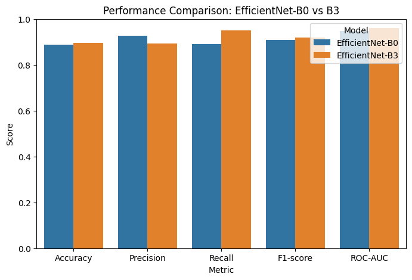
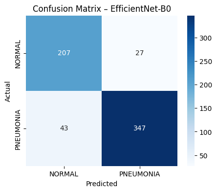
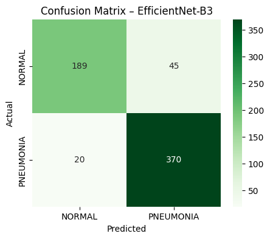
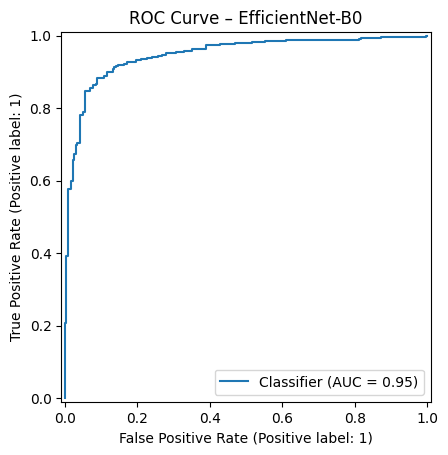
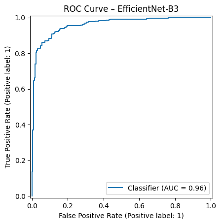
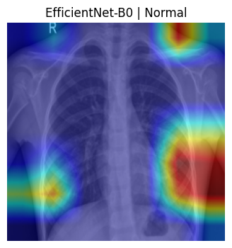
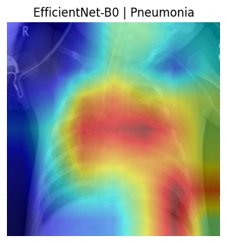
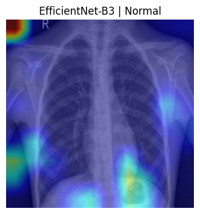
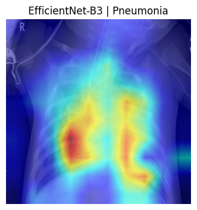

# Chest X-Ray Lung Disease Classification using EfficientNet (B0 & B3)

This project presents a deep learning-based framework for automated lung disease classification (Normal vs. Pneumonia) using chest X-ray images. Two EfficientNet variants (B0 and B3) were trained, fine-tuned, evaluated, and compared in terms of performance, efficiency, and interpretability.

---

##  Dataset Structure
   ├── Chest_XRay_Lung_Disease_Classification_EfficientNet_B0_B3.ipynb
   ├── Chest_XRay_Lung_Disease_Classification_EfficientNet_B0_B3.py 
   ├── img/    
   │     ├── results_accuracy.png
   │     └── confusion_matrix_S1.png               
   ├── LICENSE
   └── README.md

---

##  Methodology

- EfficientNet-B0 as a lightweight baseline model  
- EfficientNet-B3 as a higher-capacity model  
- Transfer learning with ImageNet-pretrained weights  
- Binary Cross-Entropy loss and Adam optimizer  
- Experiments conducted using GPU acceleration in Google Colab  

Input resolution:
- B0: 224 × 224  
- B3: 300 × 300  

---

##  Quantitative Results

The performance of EfficientNet-B0 and EfficientNet-B3 was evaluated on the test set using standard classification metrics. EfficientNet-B3 achieved higher overall performance, particularly in recall and ROC-AUC, indicating improved sensitivity for pneumonia detection.

| Model | Accuracy | Precision | Recall | F1-score | ROC-AUC |
|------|----------|-----------|--------|----------|---------|
| EfficientNet-B0 | 0.8878 | 0.9278 | 0.8897 | 0.9084 | 0.9474 |
| EfficientNet-B3 | 0.8958 | 0.8916 | 0.9487 | 0.9193 | 0.9610 |

EfficientNet-B3 demonstrates superior recall and ROC-AUC, making it more suitable for medical screening tasks where minimizing false negatives is critical.

---

##  Performance Visualization

### EfficientNet-B0 vs EfficientNet-B3

### Confusion Matrices

**EfficientNet-B0**  

**EfficientNet-B3**  

---

### ROC Curves

**EfficientNet-B0**  

**EfficientNet-B3**  

---

### Accuracy Comparison

---

##  Explainability – Grad-CAM

Grad-CAM was applied to visualize class-discriminative regions in chest X-ray images. The heatmaps demonstrate that both models focus on clinically relevant lung regions.

### EfficientNet-B0

**Normal**  

**Pneumonia**  

---

### EfficientNet-B3

**Normal**  

**Pneumonia**  

---

##  Project Execution (Google Colab)

You can run the full pipeline and experiments in Google Colab:

[Open in Colab](https://colab.research.google.com/github/ali-mohamadpour/Chest-X-Ray-Lung-Disease-Classification-EfficientNet-PyTorch/blob/main/Chest_XRay_Lung_Disease_Classification_EfficientNet_B0_B3.ipynb)

---

##  Usage Note

This project is intended for research and educational purposes only.
